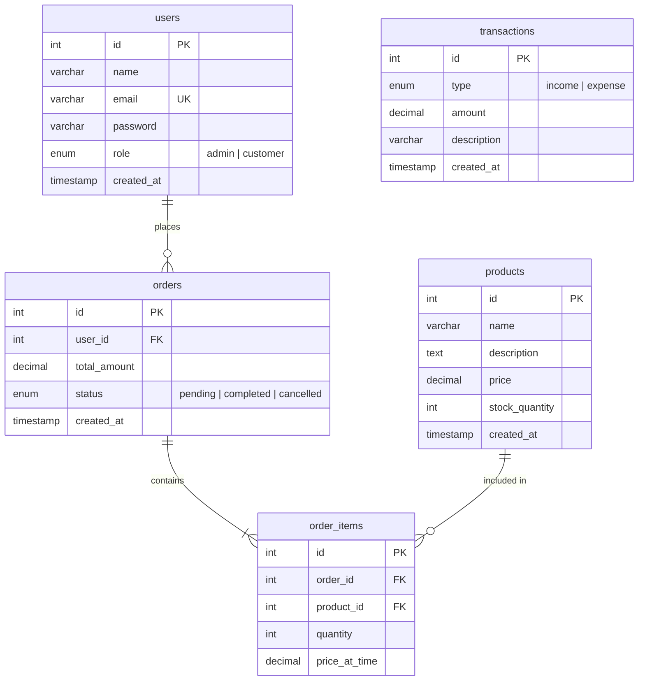

<div align="center">

# 🛒 GrocerEase

### A Full-Stack Grocery Store Management System (ERP)

[](https://grocerease123.netlify.app/)
[](https://grocerease-bnbk.onrender.com)
[](https://nextjs.org/)
[](https://expressjs.com/)
[](https://www.mysql.com/)
[](LICENSE)

**GrocerEase** is a production-ready, full-stack ERP system for managing a grocery store — from product inventory and customer orders to real-time financial analytics. Built with a modern tech stack and deployed on the cloud.

[Live Demo](#-live-demo) · [Features](#-features) · [Tech Stack](#️-tech-stack) · [Getting Started](#-getting-started) · [API Reference](#-api-reference)

</div>

---

## 🌐 Live Demo

| Service   | URL                                                          | Platform  |
|-----------|--------------------------------------------------------------|-----------|
| 🖥️ Frontend | [grocerease123.netlify.app](https://grocerease123.netlify.app/) | Netlify   |
| ⚡ Backend  | [grocerease-bnbk.onrender.com](https://grocerease-bnbk.onrender.com) | Render    |
| 🗄️ Database | Cloud MySQL                                                  | Railway   |

> **Note**: The backend is hosted on Render's free tier. The first request after idle may take ~30 seconds due to cold start — this is expected behavior.

**Demo Credentials:**
```
Admin Email:     admin@demo.com
Admin Password:  password123
```

---

## 📸 Screenshots

> Add your screenshots here. Recommended sections:

<!-- 


-->

---

## ✨ Features

### 👤 Customer Features
- **Secure Authentication** — Sign up and log in with bcrypt-hashed passwords and JWT tokens
- **Browse Products** — View all available grocery items with prices and stock availability
- **Place Orders** — Add multiple items to an order with real-time stock validation
- **Order History** — View all your past orders with timestamps and totals

### 🔐 Admin Features
- **Analytics Dashboard** — Real-time overview of revenue, orders, profit, and low-stock alerts
- **Product Management** — Full CRUD (Create, Read, Update, Delete) for the product catalog
- **Order Management** — View all customer orders across the entire store
- **Customer CRM** — See all registered users with role-based metrics
- **Sales Charts** — Interactive revenue, expense, and profit graphs (powered by Recharts)
- **Low Stock Alerts** — Automatic warnings when product stock falls below 10 units

### 🔒 Security & Data Integrity
- **JWT Authentication** — Stateless, token-based auth with automatic expiry
- **Role-Based Access Control** — Admin vs Customer permissions enforced at middleware level
- **Password Hashing** — bcrypt with salt rounds (passwords are never stored in plain text)
- **SQL Injection Prevention** — Parameterized queries throughout the entire codebase
- **Database Transactions** — Atomic order processing with automatic rollback on failure
- **Row-Level Locking** — `SELECT ... FOR UPDATE` prevents race conditions during concurrent orders

---

## 🛠️ Tech Stack

| Layer       | Technology         | Version  | Purpose                            |
|-------------|-------------------|----------|------------------------------------|
| **Frontend** | Next.js (App Router) | 16.2.1  | React framework with SSR/SSG       |
|             | React              | 19.2.4   | UI component library               |
|             | Tailwind CSS       | 4        | Utility-first CSS framework        |
|             | Recharts           | 3.8.1    | Dashboard charts and graphs        |
| **Backend**  | Node.js            | 18+      | JavaScript runtime                 |
|             | Express.js         | 5.2.1    | Web server framework               |
|             | mysql2             | 3.20.0   | MySQL driver with connection pools  |
|             | jsonwebtoken       | 9.0.3    | JWT generation and verification    |
|             | bcryptjs           | 3.0.3    | Password hashing                   |
| **Database** | MySQL              | 8+       | Relational database                |
| **Hosting**  | Netlify            | —        | Frontend deployment (CDN)           |
|             | Render             | —        | Backend deployment (Node.js)        |
|             | Railway            | —        | Cloud MySQL database               |

---

## 🏗️ Architecture

```
┌──────────────────┐         ┌──────────────────────────────┐         ┌─────────────┐
│                  │  HTTP   │         BACKEND              │  SQL    │             │
│    FRONTEND      │────────▸│                              │────────▸│   DATABASE  │
│   (Next.js)      │◂────────│  Routes → Middleware →       │◂────────│   (MySQL)   │
│                  │  JSON   │  Controllers → Services      │ Results │             │
│  Port: 3000      │         │                              │         │  Railway    │
│  Netlify         │         │  Port: 5000 | Render         │         │             │
└──────────────────┘         └──────────────────────────────┘         └─────────────┘
```

### Backend Layered Architecture

```
HTTP Request
     │
     ▼
┌─────────────┐   URL mapping
│   Routes    │   "Which controller handles /api/products?"
└──────┬──────┘
       │
       ▼
┌─────────────┐   Security gates
│ Middleware   │   "Is the user logged in? Are they an admin?"
└──────┬──────┘
       │
       ▼
┌─────────────┐   HTTP handling
│ Controllers │   "Read the request, call the service, send the response"
└──────┬──────┘
       │
       ▼
┌─────────────┐   Business logic + Database
│  Services   │   "Validate data, run SQL queries, apply rules"
└──────┬──────┘
       │
       ▼
┌─────────────┐
│  MySQL DB   │
└─────────────┘
```

---

## 📁 Project Structure

```
GrocerEase/
│
├── frontend/                    # Next.js 16 (App Router)
│   ├── app/
│   │   ├── layout.js            # Root layout with AuthProvider
│   │   ├── page.js              # Home / Landing page
│   │   ├── globals.css          # Global styles + CSS custom properties
│   │   ├── login/
│   │   │   └── page.js          # Login page
│   │   └── admin/
│   │       ├── layout.js        # Admin layout with sidebar
│   │       ├── dashboard/       # Analytics dashboard page
│   │       ├── products/        # Product management page
│   │       └── customers/       # Customer CRM page
│   ├── components/
│   │   └── Navbar.js            # Navigation bar component
│   ├── context/
│   │   └── AuthContext.js       # React Context for auth state
│   └── package.json
│
├── backend/                     # Express.js 5
│   ├── server.js                # Entry point — creates and starts the server
│   ├── config/
│   │   └── db.js                # MySQL connection pool configuration
│   ├── routes/                  # URL → Controller mapping
│   │   ├── authRoutes.js
│   │   ├── productRoutes.js
│   │   ├── orderRoutes.js
│   │   ├── dashboardRoutes.js
│   │   └── userRoutes.js
│   ├── middleware/              # Security gates
│   │   └── authMiddleware.js    # JWT verification + admin role check
│   ├── controllers/             # HTTP request/response handling
│   │   ├── authController.js
│   │   ├── productController.js
│   │   ├── orderController.js
│   │   ├── dashboardController.js
│   │   └── userController.js
│   ├── services/                # Business logic + database queries
│   │   ├── authService.js
│   │   ├── productService.js
│   │   ├── orderService.js
│   │   ├── dashboardService.js
│   │   └── userService.js
│   ├── scripts/                 # Database utilities
│   │   ├── setup_db.js          # Creates all tables
│   │   └── seed_db.js           # Fills DB with demo data
│   └── package.json
│
├── netlify.toml                 # Netlify deployment config
├── AGENTS.md                    # AI agent instructions
└── README.md                    # You are here!
```

---

## 🚀 Getting Started

### Prerequisites

- **Node.js** v18 or higher — [Download](https://nodejs.org/)
- **MySQL** 8+ — Either local installation or a cloud provider (e.g., [Railway](https://railway.app/))
- **Git** — [Download](https://git-scm.com/)

### 1. Clone the Repository

```bash
git clone https://github.com/shwet1808/GrocerEase.git
cd GrocerEase
```

### 2. Set Up the Backend

```bash
# Navigate to the backend directory
cd backend

# Install dependencies
npm install

# Create a .env file with your database credentials
# (copy and edit the template below)
```

Create a `backend/.env` file:

```env
DB_HOST=your_mysql_host
DB_PORT=3306
DB_USER=your_mysql_user
DB_PASSWORD=your_mysql_password
DB_NAME=your_database_name
JWT_SECRET=your_jwt_secret_key
PORT=5000
```

```bash
# Create the database tables
node scripts/setup_db.js

# (Optional) Seed the database with demo data
node scripts/seed_db.js

# Start the backend server
npm run dev
```

The backend will be running at `http://localhost:5000`.

### 3. Set Up the Frontend

```bash
# Open a new terminal and navigate to the frontend directory
cd frontend

# Install dependencies
npm install

# Start the development server
npm run dev
```

The frontend will be running at `http://localhost:3000`.

> **Important**: The backend must be running before you start the frontend, as the frontend makes API calls to `http://localhost:5000`.

---

## 📡 API Reference

All endpoints are prefixed with `/api`.

### Authentication

| Method | Endpoint          | Auth     | Description                |
|--------|-------------------|----------|----------------------------|
| POST   | `/api/auth/signup` | Public   | Register a new user        |
| POST   | `/api/auth/login`  | Public   | Login and receive JWT token |

### Products

| Method | Endpoint             | Auth          | Description                    |
|--------|----------------------|---------------|--------------------------------|
| GET    | `/api/products`      | Public        | Get all products               |
| GET    | `/api/products/:id`  | Public        | Get a single product by ID     |
| POST   | `/api/products`      | Admin only    | Create a new product           |
| PUT    | `/api/products/:id`  | Admin only    | Update an existing product     |
| DELETE | `/api/products/:id`  | Admin only    | Delete a product               |

### Orders

| Method | Endpoint              | Auth          | Description                     |
|--------|-----------------------|---------------|---------------------------------|
| POST   | `/api/orders`         | Logged in     | Place a new order               |
| GET    | `/api/orders/myorders`| Logged in     | Get current user's order history|
| GET    | `/api/orders`         | Admin only    | Get all orders (all customers)  |

### Dashboard

| Method | Endpoint         | Auth          | Description                         |
|--------|------------------|---------------|-------------------------------------|
| GET    | `/api/dashboard`  | Admin only    | Get store analytics & stats         |

### Users

| Method | Endpoint      | Auth          | Description                        |
|--------|---------------|---------------|------------------------------------|
| GET    | `/api/users`   | Admin only    | Get all users with metrics         |

---

## 🗃️ Database Schema



---

## 🔑 Environment Variables

### Backend (`backend/.env`)

| Variable       | Description                                        | Example                |
|----------------|----------------------------------------------------|------------------------|
| `DB_HOST`      | MySQL database host address                        | `localhost`            |
| `DB_PORT`      | MySQL database port                                | `3306`                 |
| `DB_USER`      | MySQL database username                            | `root`                 |
| `DB_PASSWORD`  | MySQL database password                            | `your_password`        |
| `DB_NAME`      | MySQL database name                                | `grocerease`           |
| `JWT_SECRET`   | Secret key for signing JWT tokens                  | `your_secret_key`      |
| `PORT`         | Port the backend server runs on                    | `5000`                 |

### Frontend (Netlify Environment)

| Variable              | Description                           | Example                                    |
|-----------------------|---------------------------------------|--------------------------------------------|
| `NEXT_PUBLIC_API_URL`  | Backend API URL                       | `https://grocerease-bnbk.onrender.com`     |

---

## 🚢 Deployment

| Service   | Platform  | Trigger        | Configuration                    |
|-----------|-----------|----------------|----------------------------------|
| Frontend  | Netlify   | Push to `main` | `netlify.toml` (build config)    |
| Backend   | Render    | Push to `main` | Web Service with Node.js runtime |
| Database  | Railway   | Always running | Cloud-hosted MySQL instance      |

> **Warning**: Pushing to `main` automatically deploys to production. Always test changes locally before pushing.

---

## 🍽️ How the Backend Works (Beginner Guide)

To keep our code organized and secure, we separated our backend into an industry-standard pattern. The easiest way to understand it is to imagine a **high-end restaurant**:

### 🧑‍🍳 The Routes → **The Waiter**
When a customer clicks "Buy Apple" on the website, they send an internet request to our server. Our **Routes** act as the waiter. They look at the request and say, *"Ah, this person wants to buy something. I know exactly which Chef handles the purchases."* The Route itself does no heavy lifting; it purely directs traffic.

### 🛡️ The Middleware → **The Security Bouncer**
Before the Waiter hands the order to the Kitchen, the **Middleware** intercepts it. Its job is pure security. It checks the customer's digital ID card (called a **JWT Token**). If the user isn't logged in, or if they are a regular customer trying to sneak into an "Admin Only" area, the Bouncer instantly kicks them out.

### 📋 The Controllers → **The Maître D'**
The Controller receives the request from the Bouncer. It reads what the customer wants (from the HTTP request), calls the right Kitchen team (Service), and presents the final dish (HTTP response) back to the customer.

### 👨‍🍳 The Services → **The Kitchen/Chef**
This is where the actual cooking happens. The Service talks directly to our **Pantry** (the MySQL Database). It pulls the required ingredients, validates everything is fresh, updates the inventory, and prepares the meal (data).

---

## 🤝 Contributing

Contributions are welcome! Here's how:

1. **Fork** the repository
2. **Create** a feature branch (`git checkout -b feature/amazing-feature`)
3. **Commit** your changes (`git commit -m 'Add amazing feature'`)
4. **Push** to the branch (`git push origin feature/amazing-feature`)
5. **Open** a Pull Request

---

## 📄 License

This project is licensed under the MIT License. See the [LICENSE](LICENSE) file for details.

---

## 👤 Author

**Shwet**

- GitHub: [@shwet1808](https://github.com/shwet1808)

---

<div align="center">

Made with ❤️ for learning full-stack web development

</div>
