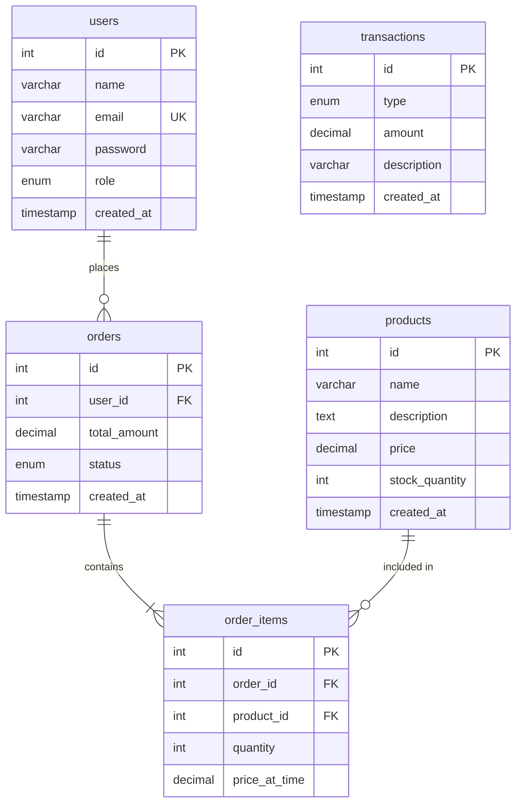

<div align="center">

# 🛒 GrocerEase

### A Full-Stack Grocery Store Management System (ERP)

[](https://grocerease123.netlify.app/)
[](https://grocerease-bnbk.onrender.com)
[](https://nextjs.org/)
[](https://expressjs.com/)
[](https://www.mysql.com/)

A production-ready ERP system for managing a grocery store — product inventory, customer orders, and real-time financial analytics. Built with Next.js 16, Express 5, and MySQL.

[Live Demo](#-live-demo) · [Features](#-features) · [Tech Stack](#️-tech-stack) · [Getting Started](#-getting-started) · [API Reference](#-api-reference)

</div>

---

## 🌐 Live Demo

| Service   | URL                                                          | Platform  |
|-----------|--------------------------------------------------------------|-----------|
| 🖥️ Frontend | [grocerease123.netlify.app](https://grocerease123.netlify.app/) | Netlify   |
| ⚡ Backend  | [grocerease-bnbk.onrender.com](https://grocerease-bnbk.onrender.com) | Render    |
| 🗄️ Database | Cloud MySQL                                                  | Railway   |

> **Note**: The backend is on Render's free tier — first request after idle may take ~30s due to cold start.

**Demo Credentials:**
```
Admin Email:     admin@demo.com
Admin Password:  password123
```

---

## ✨ Features

### 👤 Customer
- **Secure Authentication** — Sign up and log in with bcrypt-hashed passwords and JWT tokens
- **Browse Products** — View all grocery items with prices and stock availability
- **Place Orders** — Multi-item orders with real-time stock validation
- **Order History** — View past orders with timestamps and totals

### 🔐 Admin
- **Analytics Dashboard** — Real-time revenue, orders, profit, and low-stock alerts
- **Product Management** — Full CRUD for the product catalog
- **Order Management** — View all customer orders across the store
- **Customer CRM** — All registered users with role-based metrics
- **Sales Charts** — Interactive revenue/expense/profit graphs (Recharts)
- **Low Stock Alerts** — Automatic warnings when stock falls below 10 units

### 🔒 Security
- JWT authentication with auto-expiry · Role-based access control · bcrypt password hashing
- Parameterized SQL queries · Database transactions with rollback · Row-level locking (`FOR UPDATE`)

---

## 🛠️ Tech Stack

| Layer       | Technology         | Version  | Purpose                            |
|-------------|-------------------|----------|-------------------------------------|
| **Frontend** | Next.js (App Router) | 16.2.1  | React framework with SSR/SSG       |
|             | React              | 19.2.4   | UI component library               |
|             | Tailwind CSS       | 4        | Utility-first CSS framework        |
|             | Recharts           | 3.8.1    | Dashboard charts and graphs        |
| **Backend**  | Express.js         | 5.2.1    | Web server framework               |
|             | mysql2             | 3.20.0   | MySQL driver with connection pools  |
|             | jsonwebtoken       | 9.0.3    | JWT generation and verification    |
|             | bcryptjs           | 3.0.3    | Password hashing                   |
| **Database** | MySQL              | 8+       | Relational database                |
| **Hosting**  | Netlify · Render · Railway | — | Frontend · Backend · Database    |

---

## 🏗️ Architecture

```
┌──────────────────┐         ┌──────────────────────────────┐         ┌─────────────┐
│                  │  HTTP   │         BACKEND              │  SQL    │             │
│    FRONTEND      │────────▸│                              │────────▸│   DATABASE  │
│   (Next.js)      │◂────────│  Routes → Middleware →       │◂────────│   (MySQL)   │
│                  │  JSON   │  Controllers → Services      │ Results │             │
└──────────────────┘         └──────────────────────────────┘         └─────────────┘
```

### Backend Layered Architecture

```
HTTP Request
     │
     ▼
┌─────────────┐   "Which controller handles /api/products?"
│   Routes    │
└──────┬──────┘
       ▼
┌─────────────┐   "Is the user logged in? Are they an admin?"
│ Middleware   │
└──────┬──────┘
       ▼
┌─────────────┐   "Read the request, call the service, send the response"
│ Controllers │
└──────┬──────┘
       ▼
┌─────────────┐   "Validate data, run SQL queries, apply business rules"
│  Services   │
└──────┬──────┘
       ▼
┌─────────────┐
│  MySQL DB   │
└─────────────┘
```

---

## 📁 Project Structure

```
GrocerEase/
├── frontend/                    # Next.js 16 (App Router)
│   ├── app/
│   │   ├── layout.js            # Root layout with AuthProvider
│   │   ├── page.js              # Home / Landing page
│   │   ├── globals.css          # Global styles + CSS custom properties
│   │   ├── login/page.js        # Login page
│   │   └── admin/
│   │       ├── layout.js        # Admin layout with sidebar
│   │       ├── dashboard/       # Analytics dashboard
│   │       ├── products/        # Product management
│   │       └── customers/       # Customer CRM
│   ├── components/Navbar.js
│   └── context/AuthContext.js
│
├── backend/                     # Express.js 5
│   ├── server.js                # Entry point
│   ├── config/db.js             # MySQL connection pool
│   ├── routes/                  # URL → Controller mapping
│   ├── middleware/               # JWT verification + role checks
│   ├── controllers/             # HTTP request/response handling
│   ├── services/                # Business logic + SQL queries
│   └── scripts/                 # DB setup & seeding
│
└── netlify.toml                 # Netlify deployment config
```

---

## 🚀 Getting Started

### Prerequisites

- **Node.js** v18+ — [Download](https://nodejs.org/)
- **MySQL** 8+ — Local or cloud (e.g., [Railway](https://railway.app/))

### 1. Clone & Install

```bash
git clone https://github.com/shwet1808/GrocerEase.git
cd GrocerEase
```

### 2. Backend Setup

```bash
cd backend
npm install
```

Create `backend/.env`:

```env
DB_HOST=your_mysql_host
DB_PORT=3306
DB_USER=your_mysql_user
DB_PASSWORD=your_mysql_password
DB_NAME=your_database_name
JWT_SECRET=your_jwt_secret_key
PORT=5000
```

```bash
node scripts/setup_db.js          # Create tables
node scripts/seed_db.js           # (Optional) Fill with demo data
npm run dev                       # Start on http://localhost:5000
```

### 3. Frontend Setup

```bash
cd frontend
npm install
npm run dev                       # Start on http://localhost:3000
```

> Backend must be running before starting the frontend.

---

## 📡 API Reference

All endpoints are prefixed with `/api`.

| Method | Endpoint              | Auth          | Description                     |
|--------|-----------------------|---------------|---------------------------------|
| POST   | `/api/auth/signup`    | Public        | Register a new user             |
| POST   | `/api/auth/login`     | Public        | Login and receive JWT token     |
| GET    | `/api/products`       | Public        | Get all products                |
| GET    | `/api/products/:id`   | Public        | Get a single product by ID      |
| POST   | `/api/products`       | Admin only    | Create a new product            |
| PUT    | `/api/products/:id`   | Admin only    | Update an existing product      |
| DELETE | `/api/products/:id`   | Admin only    | Delete a product                |
| POST   | `/api/orders`         | Logged in     | Place a new order               |
| GET    | `/api/orders/myorders`| Logged in     | Get your order history          |
| GET    | `/api/orders`         | Admin only    | Get all orders (all customers)  |
| GET    | `/api/dashboard`      | Admin only    | Get store analytics & stats     |
| GET    | `/api/users`          | Admin only    | Get all users with metrics      |

---

## 🗃️ Database Schema



---

## 🍽️ How the Backend Works (Beginner Guide)

The easiest way to understand the backend is to imagine a **high-end restaurant**:

| Layer | Analogy | What it does |
|-------|---------|-------------|
| **Routes** | 🧑‍🍳 The Waiter | Looks at the incoming request and directs it to the right handler |
| **Middleware** | 🛡️ The Bouncer | Checks the customer's digital ID card (JWT token) before letting them through |
| **Controllers** | 📋 The Maître D' | Reads the request, calls the right kitchen team, and presents the final dish |
| **Services** | 👨‍🍳 The Kitchen | Does the actual cooking — talks to the database, validates data, applies business rules |

---

<div align="center">

**Built by [@shwet1808](https://github.com/shwet1808)** for learning full-stack development

</div>
